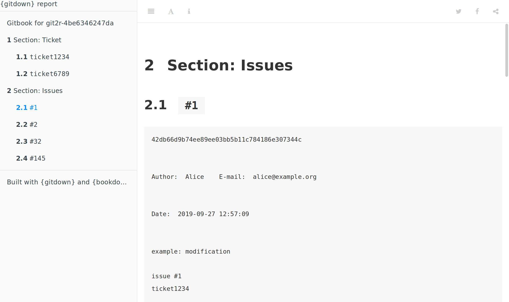

<!-- README.md is generated from README.Rmd. Please edit that file -->

```{r, include = FALSE}
knitr::opts_chunk$set(
  collapse = TRUE,
  comment = "#>",
  fig.path = "man/figures/README-",
  out.width = "100%"
)
```
# gitdown

<!-- badges: start -->
[](https://travis-ci.org/ThinkR-open/gitdown)
[](https://ci.appveyor.com/project/statnmap/gitdown)
[](https://codecov.io/github/ThinkR-open/gitdown?branch=master)
<!-- badges: end -->

The goal of {gitdown} is to build a bookdown report of commit messages arranged according to a pattern. Book can be organised according to git tags, issues mentionned (*e.g.* `#123`) or any custom character chain included in your git commit messages (*e.g.* `category_` for use like `category_ui`, `category_doc`, ...).

Full documentation on {pkgdown} site : https://thinkr-open.github.io/gitdown/index.html  

## Installation

You can install the last version of {gitdown} from Github:

``` r
remotes::install_github("ThinkR-open/gitdown")
```

## Example

This is a basic example which shows you how to solve a common problem:

```{r example, message=FALSE}
library(dplyr)
library(gitdown)
## Create fake repository for the example
repo <- fake_repo()
```

Get commits with issues mentionned. The searched pattern is a `#` followed by at least one number: `pattern = "#[[:digit:]]+"`.

```{r}
get_commits_pattern(repo, pattern = "#[[:digit:]]+", ref = "master") %>% 
  select(pattern, everything())
```

## Create a gitbook of commits sorted by a pattern

```{r, eval=FALSE}
git_down(repo, pattern = c("ticket[[:digit:]]+","#[[:digit:]]+"), 
         names_section = c("Ticket", "Issues"))
```

```{r, echo=FALSE, out.width="90%", fig.align="center"}

```
  
  
  
Please note that the 'gitdown' project is released with a
[Contributor Code of Conduct](CODE_OF_CONDUCT.md).
By contributing to this project, you agree to abide by its terms.
