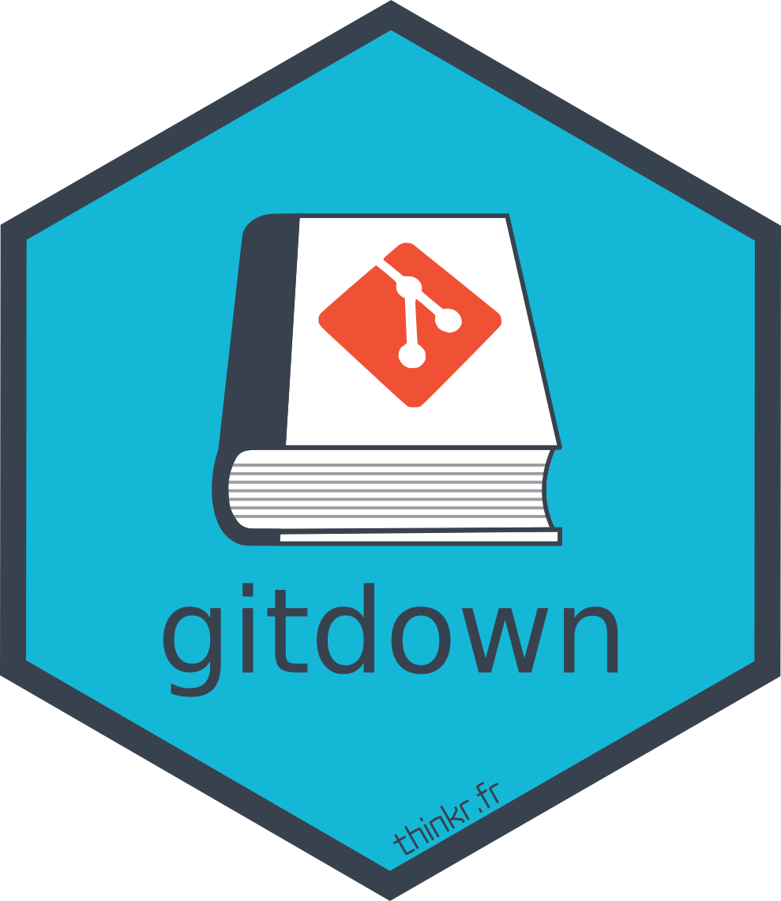
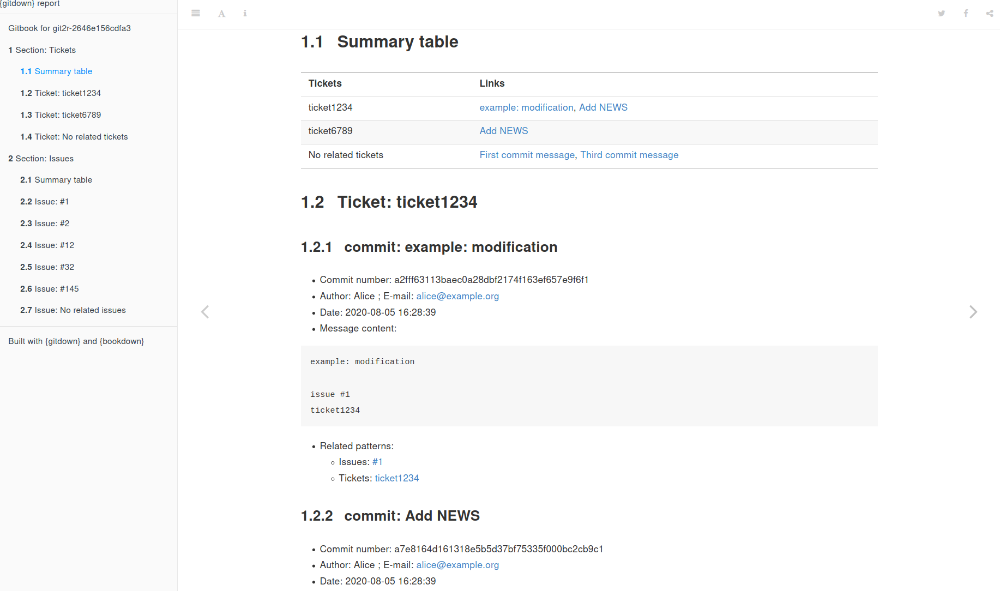
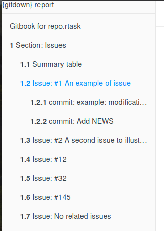

<!-- README.md is generated from README.Rmd. Please edit that file -->

# gitdown 

<!-- badges: start -->

[](https://codecov.io/github/ThinkR-open/gitdown?branch=master)
[](https://github.com/ThinkR-open/gitdown/actions)
<!-- badges: end -->

The goal of {gitdown} is to build a bookdown report of commit messages
arranged according to a pattern. Book can be organized according to git
tags, issues mentioned (*e.g.* `#123`) or any custom character chain
included in your git commit messages (*e.g.* `category_` for use like
`category_ui`, `category_doc`, …).

Full documentation on {pkgdown} site :
<https://thinkr-open.github.io/gitdown/index.html>

## Installation

You can install the last version of {gitdown} from GitHub:

``` r
remotes::install_github("ThinkR-open/gitdown")
```

## Create a reproducible example of a versioned directory

Create a versioned directory with some commits and a NEWS.md in a
temporary directory

-   Some commits mention an issue with `#`
-   Some commits mention a ticket with `ticket`
-   A commit is associated with a tag

``` r
library(dplyr)
library(gitdown)
## Create fake repository for the example
repo <- fake_repo()
```

## Create a gitbook of commits sorted by a pattern

The main function of {gitdown} is to build this gitbook with all commit
messages ordered according to a pattern. Each commit message associated
with an issue will be recorded in the section of this issue. A commit
message can thus appears multiple times if it is associated with
multiple issues.  
If you have your own referencing system for tickets in an external
software, you can also create the gitbook associated like using `ticket`
as in the example below.

``` r
git_down(repo, pattern = c("Tickets" = "ticket[[:digit:]]+",
                           "Issues" = "#[[:digit:]]+"))
```



If you add a table of correspondence, you can change titles of the
patterns.  
*Note that you can use [{gitlabr}](https://statnmap.github.io/gitlabr/)
or [{gh}](https://gh.r-lib.org) to retrieve list of issues from GitLab
or GitHub respectively, as presented in [“Download GitLab or GitHub
issues and make a summary report of your
commits”](https://rtask.thinkr.fr/download-gitlab-or-github-issues-and-make-a-summary-report-of-your-commits/).*

``` r
# With table of correspondence
pattern.table <- data.frame(
  number = c("#2", "#1", "#1000"),
  title = c("#2 A second issue to illustrate a blog post",
            "#1 An example of issue",
            "#1000 issue with no commit"))
git_down(
  pattern = c("Issue" = "#[[:digit:]]+"),
  pattern.table = pattern.table
)
```

*Note that characters like `[`, `]`, `_` or `*` will be replaced by `-`
in the titles to avoid conflicts with markdown syntax.*



## Read list of commits and extract information

As a side effect of {gitdown}, you can get some intermediate information
used to build the book with some exported functions.

Get commits with issues mentioned. The searched pattern is a `#`
followed by at least one number: `"#[[:digit:]]+"`. Variable
`pattern.content` lists patterns found in the commit messages.

``` r
get_commits_pattern(repo, pattern = "#[[:digit:]]+", ref = "master") %>% 
  select(pattern.content, everything())
#> 4 commits found.
#> # A tibble: 7 x 12
#>   pattern.content sha    summary message  author email when                order
#>   <chr>           <chr>  <chr>   <chr>    <chr>  <chr> <dttm>              <int>
#> 1 #32             e66cf… Add NE… "Add NE… Alice  alic… 2021-05-08 18:00:01     4
#> 2 #1              e66cf… Add NE… "Add NE… Alice  alic… 2021-05-08 18:00:01     4
#> 3 #12             e66cf… Add NE… "Add NE… Alice  alic… 2021-05-08 18:00:01     4
#> 4 #2              cebbb… Third … "Third … Alice  alic… 2021-05-08 18:00:01     3
#> 5 #145            cebbb… Third … "Third … Alice  alic… 2021-05-08 18:00:01     3
#> 6 #1              934b8… exampl… "exampl… Alice  alic… 2021-05-08 18:00:01     2
#> 7 <NA>            1ba16… First … "First … Alice  alic… 2021-05-08 18:00:01     1
#> # … with 4 more variables: tag.name <chr>, tag.message <chr>,
#> #   pattern.type <chr>, pattern.title <chr>
```

Get commits with issues and specific home-made pattern. Use a named
vector to properly separate types of patterns.

``` r
get_commits_pattern(
  repo, 
  pattern =  c("Tickets" = "ticket[[:digit:]]+", "Issues" = "#[[:digit:]]+"),
  ref = "master"
) %>% 
  select(pattern.type, pattern.content, everything())
#> 4 commits found.
#> # A tibble: 12 x 12
#>    pattern.type pattern.content sha       summary   message        author email 
#>    <chr>        <chr>           <chr>     <chr>     <chr>          <chr>  <chr> 
#>  1 Tickets      ticket6789      e66cf6b1… Add NEWS  "Add NEWS\n\n… Alice  alice…
#>  2 Tickets      ticket1234      e66cf6b1… Add NEWS  "Add NEWS\n\n… Alice  alice…
#>  3 Issues       #32             e66cf6b1… Add NEWS  "Add NEWS\n\n… Alice  alice…
#>  4 Issues       #1              e66cf6b1… Add NEWS  "Add NEWS\n\n… Alice  alice…
#>  5 Issues       #12             e66cf6b1… Add NEWS  "Add NEWS\n\n… Alice  alice…
#>  6 Tickets      <NA>            cebbb5e9… Third co… "Third commit… Alice  alice…
#>  7 Issues       #2              cebbb5e9… Third co… "Third commit… Alice  alice…
#>  8 Issues       #145            cebbb5e9… Third co… "Third commit… Alice  alice…
#>  9 Tickets      ticket1234      934b8178… example:… "example: mod… Alice  alice…
#> 10 Issues       #1              934b8178… example:… "example: mod… Alice  alice…
#> 11 Tickets      <NA>            1ba16a26… First co… "First commit… Alice  alice…
#> 12 Issues       <NA>            1ba16a26… First co… "First commit… Alice  alice…
#> # … with 5 more variables: when <dttm>, order <int>, tag.name <chr>,
#> #   tag.message <chr>, pattern.title <chr>
```

## Create a vignette that lists all files with date of modification

``` r
repo_pkg <- fake_repo(as.package = TRUE)
# List only files in R/ directory
create_vignette_last_modif(repo_pkg)
# List all files of the git repository
create_vignette_last_modif(repo_pkg, path = "")
```

With this example, the vignette will show this content:

| File         | Tracked in git | Date of creation    | Last modification   |
|:-------------|:---------------|:--------------------|:--------------------|
| NEWS.md      | Yes            | 2021-05-08 20:00:01 | 2021-05-08 20:00:01 |
| example.txt  | Yes            | 2021-05-08 20:00:01 | 2021-05-08 20:00:01 |
| R/my\_mean.R | No             | NA                  | 2021-05-08 20:00:01 |

## Sponsor

The development of this package has been sponsored by:

<a href = "https://www.servier.fr/"></img></a>

## Code of Conduct

Please note that the {gitdown} project is released with a [Contributor
Code of
Conduct](https://contributor-covenant.org/version/2/0/CODE_OF_CONDUCT.html).
By contributing to this project, you agree to abide by its terms.
